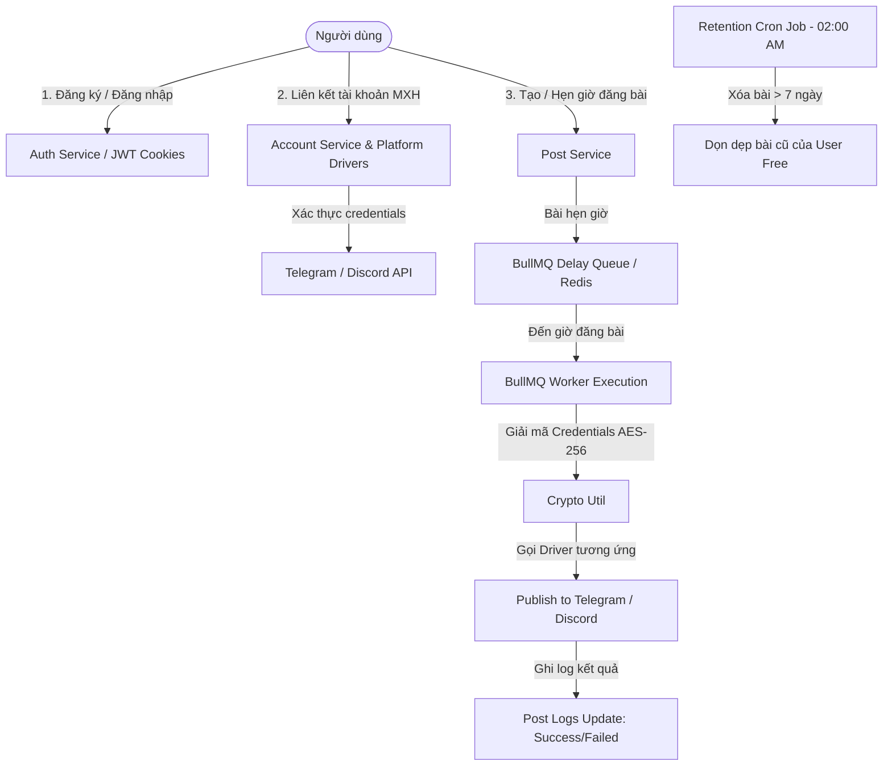

# 🚀 TÀI LIỆU TOÀN DIỆN HỆ THỐNG AUTOPOST: BACKEND API & MÔ TẢ THIẾT KẾ FRONTEND (REACTJS + VITE + TAILWINDCSS + ANT DESIGN)

> **Mục đích:** Tài liệu này chứa toàn bộ luồng hoạt động, cấu trúc API (Input/Output/Flow) và thiết kế giao diện chi tiết từng trang của hệ thống AutoPost. Bạn có thể sao chép toàn bộ nội dung file này đưa cho AI Code Generator (như Claude 3.5, GPT-4o, Bolt.new...) để khởi tạo toàn bộ dự án Frontend chuẩn chỉnh 100%.

---

## 📑 MỤC LỤC
1. [Tổng Quan Luồng Hoạt Động & Kiến Trúc Hệ Thống (Backend)](#1-tổng-quan-luồng-hoạt-động--kiến-trúc-hệ-thống)
2. [Quy Định & Giới Hạn Gói Dịch Vụ (Free vs PRO)](#2-quy-định--giới-hạn-gói-dịch-vụ-free-vs-pro)
3. [Mô Tả Chi Tiết Toàn Bộ Backend APIs](#3-mô-tả-chi-tiết-toàn-bộ-backend-apis)
   - 3.1. Authentication APIs (`/api/v1/auth`)
   - 3.2. User APIs (`/api/v1/users`)
   - 3.3. Social Account Connection APIs (`/api/v1/accounts`)
   - 3.4. Media Upload APIs (`/api/v1/media`)
   - 3.5. Post Management APIs (`/api/v1/posts`)
   - 3.6. Transaction & Payment APIs (`/api/v1/transactions`)
   - 3.7. Admin Management APIs (`/api/v1/admin`)
4. [Cấu Trúc Thư Mục Frontend Chuẩn (ReactJS + Vite)](#4-cấu-trúc-thư-mục-frontend-chuẩn-reactjs--vite)
5. [Thiết Kế Hệ Thống UI/UX & Design System](#5-thiết-kế-hệ-thống-uiux--design-system)
6. [Chi Tiết Thiết Kế Chi Tiết Từng Trang Giao Diện (Page Specs)](#6-chi-tiết-thiết-kế-từng-trang-giao-diện)
   - 6.1. Auth Layout: Login & Register Page
   - 6.2. Dashboard Overview Page
   - 6.3. Connected Accounts Management Page (Social Accounts)
   - 6.4. Create & Edit Post Page (Rich Scheduler & Platform Target Selector)
   - 6.5. Post History & Management Page (Logs & Execution Status)
   - 6.6. Billing & Subscription Upgrade Page (PayOS Integration)
   - 6.7. User Profile & Security Settings Page
   - 6.8. Admin - User Management & System Control Page
7. [Prompt Mẫu Đặt Cho AI Bot Để Gen Code FE](#7-prompt-mẫu-đặt-cho-ai-bot-để-gen-code-fe)

---

## 1. TỔNG QUAN LUỒNG HOẠT ĐỘNG & KIẾN TRÚC HỆ THỐNG

### 1.1. Luồng Hoạt Động Tổng Thể (Core Workflow)
Hệ thống **AutoPost** cho phép người dùng quản lý, lên lịch và tự động đăng bài viết (kèm hình ảnh/video) lên nhiều nền tảng mạng xã hội (hiện tại hỗ trợ **Telegram Channel/Group** và **Discord Channel Webhook**, mở rộng cho Facebook/các nền tảng khác).



### 1.2. Các Thành Phần Chính Trong Backend
1. **Xác thực & Bảo mật (Auth & Security):**
   - Đăng nhập trả về **AccessToken** (hạn 15 phút) và **RefreshToken** (hạn 7 ngày).
   - Lưu trữ an toàn trong **HTTPOnly Cookies** (`accessToken`, `refreshToken`).
   - Mật khẩu mã hóa bằng **bcrypt**. Thông tin nhạy cảm của tài khoản MXH (Bot Token, Webhook URL) mã hóa **AES-256-GCM** trước khi lưu DB.
2. **Hàng Đợi Hẹn Giờ (BullMQ + Redis):**
   - Khi bài viết có `scheduledAt` trong tương lai, backend tính số mili-giây `delay` và đẩy job vào BullMQ Queue `PostQueue`.
   - `postWorker` lắng nghe khi job đến hạn -> tự động kích hoạt hàm `executePublishJob`.
   - Xử lý bất đồng bộ từng tài khoản: Nếu 1 tài khoản bị lỗi (vd: Bot bị kick khỏi Telegram), các tài khoản khác trong cùng bài viết vẫn đăng bình thường. Kết quả từng tài khoản được ghi chi tiết vào mảng `logs`.
3. **Cron Job Dọn Rác (Retention Job):**
   - Chạy định kỳ vào 02:00 AM mỗi ngày (`node-cron`).
   - Tự động xóa tất cả các bài viết đã tạo quá **7 ngày** của các người dùng ở **gói Free**.

---

## 2. QUY ĐỊNH & GIỚI HẠN GÓI DỊCH VỤ (FREE VS PRO)

| Tính Năng / Giới Hạn | Gói FREE | Gói PRO |
| :--- | :--- | :--- |
| **Số tài khoản MXH liên kết** | Tối đa **3 tài khoản** | **Không giới hạn** |
| **Số bài đăng trong tháng** | Tối đa **30 bài/tháng** | **Không giới hạn** |
| **Hàng đợi bài hẹn giờ (Scheduled)**| Tối đa **3 bài đang chờ** trong queue | **Không giới hạn** |
| **Thời gian hẹn giờ tối đa** | Tối đa **24 giờ** tính từ hiện tại | **Tùy chọn tương lai bất kỳ** |
| **Đính kèm File Media (Ảnh/Video)**| ❌ **Không hỗ trợ** (Chỉ đăng Text) | ✅ **Tối đa 5 ảnh/video** qua Cloudinary |
| **Lưu trữ lịch sử đăng bài** | Xóa tự động sau **7 ngày** | **Lưu vĩnh viễn** |
| **Giá dịch vụ** | **0 VNĐ / tháng** | **100,000 VNĐ / 30 ngày** (PayOS Payment) |

---

## 3. MÔ TẢ CHI TIẾT TOÀN BỘ BACKEND APIS

### Base URL: `/api/v1`

---

### 3.1. Authentication APIs (`/api/v1/auth`)

#### 1. Đăng ký tài khoản (`POST /api/v1/auth/signup`)
- **Headers:** `Content-Type: application/json`
- **Request Body:**
  ```json
  {
    "name": "Nguyễn Văn A",
    "email": "user@example.com",
    "password": "Password123!"
  }
  ```
- **Response Success (201 Created):**
  ```json
  {
    "message": "User created successfully",
    "data": {
      "_id": "669db123abc...",
      "name": "Nguyễn Văn A",
      "email": "user@example.com",
      "role": "user",
      "plan": "free",
      "isBanned": false,
      "planExpiredAt": null,
      "createdAt": "2026-07-22T08:00:00.000Z"
    }
  }
  ```
- **Response Errors:**
  - `400 Bad Request` (`SYS_002`): Thiếu thông tin hoặc Email/Password không đúng định dạng.
  - `409 Conflict` (`USER_002`): Email đã tồn tại trong hệ thống.

---

#### 2. Đăng nhập (`POST /api/v1/auth/signin`)
- **Request Body:**
  ```json
  {
    "email": "user@example.com",
    "password": "Password123!"
  }
  ```
- **Response Header / Cookies Set:**
  - `accessToken`: JWT Token (maxAge: 15 min, httpOnly: true)
  - `refreshToken`: JWT Token (maxAge: 7 days, httpOnly: true, path: `/api/v1/auth`)
- **Response Success (200 OK):**
  ```json
  {
    "success": true,
    "message": "Sign in successful"
  }
  ```
- **Response Errors:**
  - `404 Not Found` (`USER_001`): Email không tồn tại.
  - `401 Unauthorized` (`AUTH_001`): Mật khẩu không chính xác.

---

#### 3. Làm mới Token (`POST /api/v1/auth/refresh`)
- **Cookie Required:** `refreshToken`
- **Response Success (200 OK):** Thiết lập lại 2 Cookies mới (`accessToken`, `refreshToken`).
  ```json
  {
    "success": true,
    "message": "Token refreshed"
  }
  ```
- **Response Errors:**
  - `403 Forbidden` (`AUTH_002`): Refresh token không hợp lệ hoặc đã bị đăng xuất/hết hạn.

---

#### 4. Đăng xuất (`POST /api/v1/auth/logout`)
- **Cookie Required:** `accessToken`, `refreshToken`
- **Response Success (200 OK):** Xóa toàn bộ Cookies & xóa Refresh Token trong Database.
  ```json
  {
    "success": true,
    "message": "Logged out successfully"
  }
  ```

---

### 3.2. User APIs (`/api/v1/users`)

#### 1. Lấy thông tin cá nhân (`GET /api/v1/users/profile`)
- **Headers / Cookie:** Require `accessToken`
- **Response Success (200 OK):**
  ```json
  {
    "message": "User profile fetched successfully",
    "data": {
      "_id": "669db123abc...",
      "name": "Nguyễn Văn A",
      "email": "user@example.com",
      "role": "user",
      "plan": "pro",
      "isBanned": false,
      "planExpiredAt": "2026-08-22T08:00:00.000Z",
      "createdAt": "2026-07-22T08:00:00.000Z"
    }
  }
  ```

---

#### 2. Đổi mật khẩu (`PUT /api/v1/users/change-password`)
- **Request Body:**
  ```json
  {
    "oldPassword": "OldPassword123!",
    "newPassword": "NewPassword456!"
  }
  ```
- **Response Success (200 OK):**
  ```json
  {
    "message": "Mật khẩu đã được thay đổi thành công"
  }
  ```
- **Response Errors:**
  - `401 Unauthorized` (`AUTH_001`): Mật khẩu cũ không chính xác.

---

### 3.3. Social Account Connection APIs (`/api/v1/accounts`)

#### 1. Liên kết tài khoản MXH (`POST /api/v1/accounts/connect`)
- **Request Body (Telegram example):**
  ```json
  {
    "platform": "telegram",
    "config": {
      "botToken": "123456789:ABCdefGhIJKlmNoPQRsTUVwxyZ",
      "chatId": "-100123456789"
    }
  }
  ```
- **Request Body (Discord Webhook example):**
  ```json
  {
    "platform": "discord",
    "config": {
      "webhookUrl": "https://discord.com/api/webhooks/123456/abcdef..."
    }
  }
  ```
- **Luồng xử lý BE:**
  1. Đếm số lượng tài khoản đã liên kết của user. Gói Free tối đa 3 tài khoản -> Trả lỗi `403` nếu quá hạn.
  2. Gọi `driver.fetchAccountName(config)` đến Telegram/Discord API để xác minh credentials.
  3. Mã hóa `config` bằng AES-256 trước khi lưu DB.
- **Response Success (201 Created):**
  ```json
  {
    "message": "Social account connected successfully",
    "data": {
      "_id": "669dc456def...",
      "userId": "669db123abc...",
      "platform": "telegram",
      "platformAccountName": "Telegram: Kênh Tin Tức 24/7",
      "isActive": true,
      "createdAt": "2026-07-22T08:30:00.000Z"
    }
  }
  ```

---

#### 2. Lấy danh sách tài khoản đã liên kết (`GET /api/v1/accounts`)
- **Query Params (Optional):** `?platform=telegram&isActive=true`
- **Response Success (200 OK):** *(Trường `config` được ẩn vì lý do bảo mật)*
  ```json
  {
    "message": "Connected accounts fetched successfully",
    "data": [
      {
        "_id": "669dc456def...",
        "platform": "telegram",
        "platformAccountName": "Telegram: Kênh Tin Tức 24/7",
        "isActive": true,
        "createdAt": "2026-07-22T08:30:00.000Z"
      },
      {
        "_id": "669dc789ghi...",
        "platform": "discord",
        "platformAccountName": "Discord: #thong-bao-general",
        "isActive": true,
        "createdAt": "2026-07-22T08:45:00.000Z"
      }
    ]
  }
  ```

---

#### 3. Bật/Tắt hoặc Cập nhật Config Tài Khoản (`PUT /api/v1/accounts/:accountId`)
- **Request Body:**
  ```json
  {
    "isActive": false
  }
  ```
  *Hoặc cập nhật lại credentials:*
  ```json
  {
    "config": {
      "botToken": "NEW_TOKEN...",
      "chatId": "-100987654321"
    }
  }
  ```

---

#### 4. Hủy liên kết tài khoản (`DELETE /api/v1/accounts/:accountId`)
- **Response Success (200 OK):**
  ```json
  {
    "message": "Social account disconnected successfully"
  }
  ```

---

### 3.4. Media Upload APIs (`/api/v1/media`)

#### Upload đính kèm file Ảnh/Video (`POST /api/v1/media/upload`)
- **Headers:** `Content-Type: multipart/form-data`
- **Form Data:** `media`: Array (Tối đa 5 file)
- **Ràng buộc:** Gói Free gọi vào API này sẽ nhận lỗi `403 Forbidden` (`AUTH_003`).
- **Response Success (201 Created):**
  ```json
  {
    "message": "Files uploaded successfully",
    "data": {
      "mediaUrls": [
        "https://res.cloudinary.com/demo/image/upload/v1721639000/sample1.jpg",
        "https://res.cloudinary.com/demo/image/upload/v1721639000/sample2.jpg"
      ]
    }
  }
  ```

---

### 3.5. Post Management APIs (`/api/v1/posts`)

#### 1. Tạo mới hoặc Hẹn giờ đăng bài (`POST /api/v1/posts`)
- **Request Body:**
  ```json
  {
    "content": "🔥 Bài viết giới thiệu sản phẩm mới cực HOT!",
    "accountIds": ["669dc456def...", "669dc789ghi..."],
    "mediaUrls": [
      "https://res.cloudinary.com/demo/image/upload/v1721639000/sample1.jpg"
    ],
    "scheduledAt": "2026-07-22T15:00:00.000Z"
  }
  ```
  *(Lưu ý: Nếu không truyền `scheduledAt`, bài viết tạo ở dạng `draft` - Nháp).*
- **Ràng buộc Gói Free:**
  - Hẹn giờ `scheduledAt` không được quá **24 giờ** kể từ hiện tại.
  - Tối đa **30 bài/tháng**.
  - Tối đa **3 bài ở trạng thái `scheduled`** trong hàng đợi.
  - Không được chứa `mediaUrls`.
- **Response Success (201 Created):**
  ```json
  {
    "message": "Post created and scheduled successfully",
    "data": {
      "_id": "669de111aaa...",
      "userId": "669db123abc...",
      "accountIds": ["669dc456def...", "669dc789ghi..."],
      "content": "🔥 Bài viết giới thiệu sản phẩm mới cực HOT!",
      "mediaUrls": ["https://res.cloudinary.com/.../sample1.jpg"],
      "status": "scheduled",
      "scheduledAt": "2026-07-22T15:00:00.000Z",
      "bullJobId": "post-job-669de111aaa...",
      "logs": [],
      "createdAt": "2026-07-22T09:00:00.000Z"
    }
  }
  ```

---

#### 2. Lấy danh sách bài đăng (`GET /api/v1/posts`)
- **Query Params:** `?page=1&limit=10&status=scheduled`
  *(Trạng thái lọc hỗ trợ: `draft`, `scheduled`, `processing`, `published`, `failed`)*
- **Response Success (200 OK):**
  ```json
  {
    "message": "Posts fetched successfully",
    "data": [
      {
        "_id": "669de111aaa...",
        "content": "🔥 Bài viết giới thiệu sản phẩm mới...",
        "status": "published",
        "scheduledAt": "2026-07-22T08:00:00.000Z",
        "createdAt": "2026-07-22T07:50:00.000Z"
      }
    ]
  }
  ```

---

#### 3. Lấy chi tiết bài viết & Log lịch sử đăng (`GET /api/v1/posts/:id`)
- **Response Success (200 OK):** Populated thông tin tài khoản & danh sách log chi tiết từng nền tảng.
  ```json
  {
    "message": "Post details fetched successfully",
    "data": {
      "_id": "669de111aaa...",
      "content": "🔥 Bài viết giới thiệu...",
      "mediaUrls": ["https://res.cloudinary.com/..."],
      "status": "published",
      "accountIds": [
        {
          "_id": "669dc456def...",
          "platform": "telegram",
          "platformAccountName": "Telegram: Kênh Tin Tức 24/7"
        }
      ],
      "logs": [
        {
          "accountId": "669dc456def...",
          "platform": "telegram",
          "status": "success",
          "publishedUrl": "https://t.me/kenhtintuc247/889",
          "attemptedAt": "2026-07-22T15:00:02.120Z"
        },
        {
          "accountId": "669dc789ghi...",
          "platform": "discord",
          "status": "failed",
          "errorReason": "Discord Webhook URL đã bị xóa hoặc không hợp lệ.",
          "attemptedAt": "2026-07-22T15:00:02.450Z"
        }
      ]
    }
  }
  ```

---

#### 4. Chỉnh sửa bài viết / Đặt lại lịch hẹn (`PUT /api/v1/posts/:id`)
- **Ràng buộc:** Không thể chỉnh sửa bài viết đang ở trạng thái `processing` hoặc `published`.
- **Luồng BE:** Nếu thay đổi `scheduledAt`, hệ thống sẽ tự động hủy Job hẹn giờ cũ trong BullMQ và khởi tạo Job mới với thời gian delay cập nhật.

---

#### 5. Xóa bài viết (`DELETE /api/v1/posts/:id`)
- **Luồng BE:** Xóa dữ liệu trong MongoDB đồng thời tự động gỡ Job hẹn giờ tương ứng khỏi BullMQ Redis.

---

### 3.6. Transaction & Payment APIs (`/api/v1/transactions`)

#### 1. Tạo liên kết nâng cấp gói PRO (`POST /api/v1/transactions/create-payment`)
- **Request Body:** `{}`
- **Response Success (201 Created):**
  ```json
  {
    "message": "Payment link generated successfully",
    "data": {
      "transaction": {
        "_id": "669df888bbb...",
        "userId": "669db123abc...",
        "amount": 100000,
        "orderCode": "1721639500123",
        "status": "pending"
      },
      "checkoutUrl": "https://payos.vn/mock-checkout/1721639500123",
      "message": "This is a mock checkout URL..."
    }
  }
  ```

---

#### 2. PayOS / Mock Payment Webhook (`POST /api/v1/transactions/webhook`)
- **Request Body (Payload từ Cổng Thanh Toán):**
  ```json
  {
    "orderCode": "1721639500123",
    "status": "PAID"
  }
  ```
- **Luồng BE:** Khi `status === 'PAID'` -> Cập nhật transaction = `completed`, cập nhật User: `plan = 'pro'`, cộng thêm **30 ngày** vào `planExpiredAt`.

---

### 3.7. Admin Management APIs (`/api/v1/admin`)
*(Yêu cầu Authenticated + AuthRole = 'admin')*

- `GET /api/v1/admin/users?page=1&limit=20&search=nguyen&plan=free`: Lấy danh sách người dùng phân trang & tìm kiếm.
- `GET /api/v1/admin/users/:id`: Lấy chi tiết user + danh sách tài khoản MXH + bài viết của user đó.
- `PUT /api/v1/admin/users/:id/ban`: `{ "isBanned": true }` -> Khóa/Mở khóa tài khoản.
- `PUT /api/v1/admin/users/:id/plan`: `{ "plan": "pro", "durationDays": 30 }` -> Nâng cấp gói thủ công cho người dùng.
- `DELETE /api/v1/admin/users/:id`: Xóa vĩnh viễn user + Xóa cascading (tài khoản MXH, bài viết, hủy job BullMQ).

---

## 4. CẤU TRÚC THƯ MỤC FRONTEND CHUẨN (REACTJS + VITE)

Thư mục UI chuẩn doanh nghiệp, tối ưu hóa cho React 18+, Vite, Ant Design v5, TailwindCSS v3:

```
FE/
├── public/
│   ├── favicon.ico
│   └── logo.svg
├── src/
│   ├── api/                   # Axios Config & API Services
│   │   ├── axiosClient.js     # Axios instance với interceptors tự động refresh token
│   │   ├── authApi.js         # Gọi API Auth
│   │   ├── userApi.js         # Gọi API User & Profile
│   │   ├── accountApi.js      # Gọi API Liên kết tài khoản MXH
│   │   ├── postApi.js         # Gọi API Đăng bài & Lên lịch
│   │   ├── mediaApi.js        # Gọi API Upload Cloudinary
│   │   ├── transactionApi.js  # Gọi API Nâng cấp gói PRO / Payment
│   │   └── adminApi.js        # Gọi API Quản trị Admin
│   ├── assets/                # Images, Icons, SVGs
│   ├── components/            # Reusable Pure UI Components
│   │   ├── common/
│   │   │   ├── PlanBadge.jsx        # Badge 'FREE' (Slate) / 'PRO' (Gradient Amber/Violet)
│   │   │   ├── StatusTag.jsx        # Tag bài viết (Draft, Scheduled, Published, Failed)
│   │   │   ├── PlatformIcon.jsx     # Icon Telegram, Discord, Facebook
│   │   │   ├── LoadingSpinner.jsx   # Spin animation
│   │   │   └── ConfirmModal.jsx     # Modal xác nhận xóa / hủy
│   │   ├── layout/
│   │   │   ├── Sidebar.jsx          # Thanh điều hướng bên trái (Responsive)
│   │   │   ├── Header.jsx           # Thanh công cụ trên cùng (Profile, Plan Info, Logout)
│   │   │   └── Footer.jsx           # Footer bản quyền
│   │   └── posts/
│   │       ├── PostLogDrawer.jsx    # Drawer xem lịch sử logs chi tiết bài đăng
│   │       ├── MediaUploader.jsx    # Component chọn & xem trước ảnh/video
│   │       └── AccountSelector.jsx  # Component chọn các tài khoản để đăng
│   ├── context/               # React Context (Auth Context / Theme Context)
│   │   ├── AuthContext.jsx    # Quản lý User Profile, Login State, Auto Refetch Profile
│   │   └── ThemeContext.jsx   # Quản lý Light/Dark Mode State & LocalStorage Persist
│   ├── hooks/                 # Custom React Hooks
│   │   ├── useAuth.js         # Hook truy cập AuthContext nhanh
│   │   ├── useTheme.js        # Hook chuyển đổi Light/Dark Theme
│   │   └── useFetchPosts.js   # Custom query fetch posts
│   ├── layouts/               # Page Layout Wrappers
│   │   ├── AuthLayout.jsx     # Card căn giữa cho Login / Register
│   │   ├── DashboardLayout.jsx# Sidebar + Header (có ThemeToggle) + Container chính
│   │   └── AdminLayout.jsx    # Layout riêng biệt cho Quản trị viên
│   ├── pages/                 # Full Page Components
│   │   ├── auth/
│   │   │   ├── LoginPage.jsx
│   │   │   └── RegisterPage.jsx
│   │   ├── dashboard/
│   │   │   └── DashboardOverviewPage.jsx # Trang chủ thống kê
│   │   ├── accounts/
│   │   │   ├── ConnectedAccountsPage.jsx # Trang danh sách tài khoản
│   │   │   └── ConnectAccountModal.jsx  # Modal nhập Token/Webhook
│   │   ├── posts/
│   │   │   ├── CreatePostPage.jsx        # Trang soạn & hẹn giờ bài viết
│   │   │   └── PostsListPage.jsx         # Trang quản lý & lọc danh sách bài
│   │   ├── billing/
│   │   │   └── SubscriptionPage.jsx      # Trang mua gói PRO & PayOS QR
│   │   ├── profile/
│   │   │   └── ProfileSettingsPage.jsx   # Trang cá nhân, đổi mật khẩu & cài đặt Theme
│   │   ├── admin/
│   │   │   ├── AdminUsersPage.jsx        # Trang admin quản lý người dùng
│   │   │   └── AdminUserDetailModal.jsx  # Modal xem chi tiết user
│   │   └── NotFoundPage.jsx
│   ├── routes/                # Routing Setup
│   │   ├── AppRoutes.jsx      # Router configuration (React Router v6)
│   │   ├── ProtectedRoute.jsx # Guard kiểm tra Đăng nhập
│   │   └── AdminRoute.jsx     # Guard kiểm tra Role === 'admin'
│   ├── styles/                # CSS Configuration
│   │   └── index.css          # Tailwind Directives & Custom Utilities
│   ├── utils/                 # Formatters & Helpers
│   │   ├── dateUtil.js        # Format ngày tháng (Dayjs / date-fns)
│   │   └── errorUtil.js       # Extract message từ Error Object
│   ├── App.jsx                # App Entry với Dynamic Antd ConfigProvider (Light/Dark Algorithm)
│   └── main.jsx               # Vite Entrypoint
├── index.html
├── tailwind.config.js         # Đã cấu hình `darkMode: 'class'`
├── postcss.config.js
├── vite.config.js
└── package.json
```

---

## 5. THIẾT KẾ HỆ THỐNG UI/UX & DESIGN SYSTEM

### 5.1. Bảng Màu (Color Palette) - Modern Dual Theme (Light / Dark)
- **Theme:** Hỗ trợ chuyển đổi mượt mà giữa **Dark Mode** (Sleek Slate Dark) và **Light Mode** (Clean Professional Light).
- **Background Chính:**
  - Dark Mode: `slate-950` (`#020617`) hoặc `slate-900` (`#0f172a`)
  - Light Mode: `slate-50` (`#f8fafc`) hoặc `gray-50` (`#f9fafb`)
- **Card / Surface Background:**
  - Dark Mode: `slate-900/90` kính mờ (Glassmorphism), viền `slate-800`
  - Light Mode: `white` kính mờ, viền `slate-200`, đổ bóng nhẹ `shadow-sm`
- **Primary Brand Color:** Indigo - Violet (`#6366F1` -> `#4F46E5`)
- **PRO Plan Accent Gradient:** Amber to Violet (`from-amber-400 to-violet-600`)
- **Status Colors:**
  - **Success / Published:** Emerald (`#10B981`)
  - **Scheduled:** Sky Blue (`#0EA5E9`)
  - **Draft:** Slate (`#64748B`)
  - **Processing:** Amber (`#F59E0B`)
  - **Failed / Error:** Rose / Red (`#F43F5E`)

### 5.2. Typography & Dynamic Ant Design Theme Tuning
- **Font:** Google Font **Plus Jakarta Sans** hoặc **Inter**.
- **Ant Design `ConfigProvider` Override theo Theme Mode:**
  ```javascript
  import React from 'react';
  import { ConfigProvider, theme } from 'antd';
  import { useTheme } from './hooks/useTheme';

  const App = ({ children }) => {
    const { isDarkMode } = useTheme();

    return (
      <ConfigProvider
        theme={{
          algorithm: isDarkMode ? theme.darkAlgorithm : theme.defaultAlgorithm,
          token: {
            colorPrimary: '#6366f1',
            colorBgContainer: isDarkMode ? '#0f172a' : '#ffffff',
            colorBgElevated: isDarkMode ? '#1e293b' : '#ffffff',
            borderRadius: 10,
            fontFamily: "'Plus Jakarta Sans', sans-serif"
          }
        }}
      >
        {children}
      </ConfigProvider>
    );
  };
  ```

### 5.3. Thiết Kế & Tích Hợp Tính Năng Light / Dark Mode (Dynamic Theme Switching)

#### 1. Nguyên lý hoạt động:
- **State Management (`ThemeContext.jsx`):** Quản lý trạng thái `theme` (`'light'` | `'dark'` | `'system'`), mặc định đọc từ `localStorage.getItem('theme')` hoặc hệ thống OS người dùng (`window.matchMedia('(prefers-color-scheme: dark)')`).
- **Đồng bộ TailwindCSS:** Khi `isDarkMode === true`, tự động thêm/bớt class `dark` vào thẻ `document.documentElement` (`<html class="dark">`). Cấu hình `tailwind.config.js` với `darkMode: 'class'`.
- **Đồng bộ Ant Design:** Tự động hoán đổi giữa `theme.darkAlgorithm` và `theme.defaultAlgorithm` ngay trong `ConfigProvider` toàn cục.

#### 2. Thẻ Nút Chuyển Đổi Theme (`ThemeToggle.jsx`):
- Vị trí hiển thị: Đặt trên thanh **Header Bar** (bên cạnh Plan Badge & Avatar) và trang **Profile Settings**.
- Giao diện: Segmented Switch hoặc Icon Button mượt mà với hiệu ứng xoay icon (Mặt trời ☀️ cho Light Mode, Mặt trăng 🌙 cho Dark Mode).

#### 3. Bảng Màu So Sánh 2 Chế Độ (Color Tokens Matrix):

| Thành Phần UI | Light Mode Class | Dark Mode Class |
| :--- | :--- | :--- |
| **Nền Ứng Dụng (App Background)** | `bg-slate-50 text-slate-900` | `dark:bg-slate-950 dark:text-slate-100` |
| **Thẻ Panel / Card Container** | `bg-white border-slate-200 shadow-sm` | `dark:bg-slate-900/90 dark:border-slate-800` |
| **Header Bar & Sidebar** | `bg-white/90 border-slate-200` | `dark:bg-slate-900/80 dark:border-slate-800` |
| **Chữ Chính (Primary Text)** | `text-slate-900` | `dark:text-slate-100` |
| **Chữ Phụ / Muted Text** | `text-slate-500` | `dark:text-slate-400` |
| **Form Input & Select** | `bg-slate-100/80 border-slate-300` | `dark:bg-slate-800/80 dark:border-slate-700` |
| **Table Hover Row** | `hover:bg-slate-100` | `dark:hover:bg-slate-800/50` |

---


## 6. CHI TIẾT THIẾT KẾ TỪNG TRANG GIAO DIỆN (PAGE SPECS)

---

### 6.1. Auth Layout: Login & Register Page

#### Giao diện Login (`/login`) & Register (`/register`)
- **Bố cục:** Thẻ Glassmorphic căn giữa màn hình với nền Gradient loang hiệu ứng đốm sáng (Glowing Background Nodes).
- **Thành phần trang Login:**
  - Logo AutoPost hoạt hình (Rocket icon + Neon text).
  - Tên ứng dụng: **"AutoPost Studio"** - *Hệ thống đăng bài tự động đa nền tảng*.
  - Form Input Antd: `Email` (Prefix Icon: Mail), `Mật khẩu` (Prefix Icon: Lock, Password Toggle).
  - Nút **"Đăng Nhập"** (Button Antd `primary`, full width, hiệu ứng hover glow).
  - Liên kết chuyển đổi: *"Chưa có tài khoản? Đăng ký ngay"*.
- **Thành phần trang Register:**
  - Các trường: `Họ và tên`, `Email`, `Mật khẩu`, `Xác nhận mật khẩu`.
  - Thông báo ưu đãi: *"Đăng ký ngay hôm nay để nhận gói FREE với 30 bài đăng/tháng!"*.
- **Luồng xử lý FE:**
  - Submit Form -> Gọi `authApi.signIn()` / `authApi.signUp()`.
  - Thành công: Lưu thông tin User vào `AuthContext` -> Redirect ngay đến `/dashboard`.
  - Lỗi: Hiển thị Antd Notification / Message lỗi từ Backend (Ví dụ: Email đã tồn tại).

---

### 6.2. Dashboard Overview Page (`/dashboard`)

#### Bố cục & Tính năng chính
Trang tổng quan dạng Bảng điều khiển trung tâm (Control Center) giúp người dùng thấy ngay trạng thái hệ thống:

```
+-----------------------------------------------------------------------------------+
| [ STATS CARDS ]                                                                   |
| +-----------------+  +-----------------+  +-----------------+  +----------------+ |
| | Tài khoản MXH   |  | Bài đã đăng    |  | Bài chờ phát   |  | Gói Dịch Vụ    | |
| | 2 / 3 (Free)    |  | 18 / 30 tháng   |  | 1 Bài chờ      |  | Gói FREE       | |
| +-----------------+  +-----------------+  +-----------------+  +----------------+ |
+-----------------------------------------------------------------------------------+
| [ QUICK ACTIONS & PLAN USAGE PROGRESS ]                                            |
|  - Tiến trình sử dụng tháng: [=============>      ] 60%                             |
|  - Nút nhanh: [+ Soạn Bài Mới]   [+ Liên Kết Tài Khoản]   [⚡ Nâng Cấp PRO]        |
+-----------------------------------------------------------------------------------+
| [ RECENT POSTS TABLE / TIMELINE ]                                                 |
|  Danh sách 5 bài đăng mới nhất kèm Tag trạng thái & nút xem chi tiết               |
+-----------------------------------------------------------------------------------+
```

- **Thành phần chi tiết:**
  1. **Stat Cards (4 Thẻ chỉ số):**
     - *Thẻ 1:* Số tài khoản đã liên kết (`counts / limit`). Có progress bar nhỏ.
     - *Thẻ 2:* Số bài đã đăng trong tháng (`monthPostsCount / 30`).
     - *Thẻ 3:* Số bài đang chờ đăng (`scheduledCount / 3`).
     - *Thẻ 4:* Trạng thái Gói hiện tại (`FREE` hoặc `PRO` kèm ngày hết hạn nếu có).
  2. **Banner Cảnh Báo Giới Hạn Gói Free (nếu user là Free):**
     - Khung Nổi bật màu tím/vàng: *"Bạn đang sử dụng gói Free. Nâng cấp lên PRO để bỏ giới hạn 30 bài/tháng và mở khóa tính năng đăng ảnh/video!"* -> Nút [Nâng Cấp Ngay].
  3. **Recent Posts Timeline / Table:**
     - Bảng hiển thị: Tiêu đề bài viết (rút gọn), Danh sách icon nền tảng (Telegram/Discord), Thời gian đăng, Trạng thái (Tag Antd màu sắc), Action: [Xem chi tiết].

---

### 6.3. Connected Accounts Management Page (`/accounts`)

#### Bố cục & Tính năng chính (`/accounts`)
Quản lý tập trung tất cả tài khoản Telegram, Discord, Facebook được liên kết.

```
+-----------------------------------------------------------------------------------+
| QUẢN LÝ TÀI KHOẢN MẠNG XÃ HỘI              [+ Liên Kết Tài Khoản Mới]             |
| Quản lý bot Telegram, Discord Webhooks để tự động phát tin bài                      |
+-----------------------------------------------------------------------------------+
| GRID LIST ACCOUNTS CARDS                                                          |
| +-----------------------------------+  +-----------------------------------+      |
| | ✈️ Telegram                       |  | 👾 Discord                         |      |
| | Telegram: Kênh Tin Tức 24/7       |  | Discord: #thong-bao-general       |      |
| | Trạng thái: [ Active (Switch) ]   |  | Trạng thái: [ Active (Switch) ]   |      |
| | Ngày tạo: 22/07/2026              |  | Ngày tạo: 22/07/2026              |      |
| | [ Sửa Cấu Hình ]   [ Hủy Liên Kết ]|  | [ Sửa Cấu Hình ]   [ Hủy Liên Kết ]|      |
| +-----------------------------------+  +-----------------------------------+      |
+-----------------------------------------------------------------------------------+
```

- **Thành phần chi tiết:**
  1. **Nút [+ Liên Kết Tài Khoản Mới]:** Bấm vào mở Modal `ConnectAccountModal`.
     - *Nếu User gói Free và đã liên kết >= 3 tài khoản:* Nút bị vô hiệu hóa hoặc bấm vào hiển thị Popover/Modal thông báo nâng cấp PRO.
  2. **Account Cards Grid:**
     - Icon nền tảng lớn + Tên hiển thị tài khoản (`platformAccountName`).
     - Switch Toggle: `Bật/Tắt (isActive)`. Khi gạt switch -> gọi API `PUT /api/v1/accounts/:id`.
     - Action Buttons: `Chỉnh sửa` (Đổi Bot Token/Webhook), `Hủy liên kết` (Modal xác nhận xóa `DELETE /api/v1/accounts/:id`).
  3. **Modal `ConnectAccountModal` (Cực kỳ quan trọng):**
     - Step 1: Chọn Nền Tảng (Radio Card Button: Telegram / Discord / Facebook).
     - Step 2: Form động theo từng nền tảng:
       - *Nếu chọn Telegram:*
         - Input `Bot Token` (Hướng dẫn nhỏ: *Tạo bot qua @BotFather trên Telegram*).
         - Input `Chat ID` (Hướng dẫn nhỏ: *ID Kênh/Nhóm ví dụ: -100123456789. Đảm bảo đã thêm Bot làm Admin*).
       - *Nếu chọn Discord:*
         - Input `Webhook URL` (Hướng dẫn: *Cài đặt kênh Discord -> Integrations -> Webhooks -> Copy Webhook URL*).
     - Nút [Kiểm Tra & Kết Nối]: Khi bấm -> FE gửi API `POST /accounts/connect`. Backend sẽ test live credentials. Nếu hợp lệ -> Thông báo thành công và đóng Modal.

---

### 6.4. Create & Edit Post Page (`/posts/create` & `/posts/edit/:id`)

#### Bố cục & Tính năng chính
Giao diện soạn thảo hiện đại 2 Cột (Left: Form nhập liệu & cài đặt; Right: Live Mobile Preview bài viết).

```
+-----------------------------------------------------------------------------------+
| SOẠN BÀI VIẾT MỚI                                             [ Lưu Nháp ] [ Hẹn Giờ / Đăng Bài ] |
+--------------------------------------------------+--------------------------------|
| [ CỘT TRÁI: FORM SOẠN THẢO ]                     | [ CỘT PHẢI: PREVIEW ĐỘNG ]     |
| 1. Chọn tài khoản đăng (Multi Checkbox):         | +----------------------------+ |
|    [x] ✈️ Telegram: Kênh Tin Tức 24/7             | | 📱 Live Preview (Telegram) | |
|    [x] 👾 Discord: #thong-bao-general            | | AutoPost Bot               | |
|                                                  | | -------------------------- | |
| 2. Nội dung bài viết (Rich TextArea):            | | Nội dung bài viết sẽ       | |
|    [ Khung soạn thảo có đếm kí tự, Emoji picker ]| | hiển thị trực quan ở đây...| |
|                                                  | | [Hình ảnh đính kèm]        | |
| 3. Đính kèm File Media (Ảnh/Video):              | +----------------------------+ |
|    [ Drag & Drop Upload Zone ]                   |                                |
|    * (Badge: Gói PRO hỗ trợ tối đa 5 file)       |                                |
|                                                  |                                |
| 4. Lịch đăng bài (Scheduler Picker):             |                                |
|    (o) Đăng ngay (Draft)                         |                                |
|    (o) Lên lịch hẹn giờ: [ DatePicker ]          |                                |
+--------------------------------------------------+--------------------------------+
```

- **Thành phần chi tiết:**
  1. **Tài khoản mục tiêu (Target Accounts Selector):**
     - Danh sách các tài khoản MXH đang `isActive: true`.
     - Cho phép chọn nhiều tài khoản cùng lúc (Checkbox Group / Custom Card Chips).
  2. **Soạn nội dung bài viết:**
     - Textarea đa dòng hỗ trợ Markdown, tích hợp bộ chọn **Emoji Picker**, đếm kí tự real-time.
  3. **Khu vực Upload File Media (`MediaUploader`):**
     - *Nếu user gói FREE:* Upload Zone bị mờ (Disabled) kèm icon Khóa 🔒 + Dòng chữ: *"Đính kèm ảnh/video chỉ dành cho gói PRO. [Nâng Cấp Ngay]"*.
     - *Nếu user gói PRO:* Drag & Drop Upload hỗ trợ tối đa 5 file. Tải trực tiếp lên Cloudinary qua API `/api/v1/media/upload`, hiển thị thumbnail xem trước có nút Xóa file.
  4. **Bộ chọn thời gian đăng (Scheduler):**
     - Radio group: `Đăng nháp` vs `Lên lịch hẹn giờ`.
     - `DateTimePicker` (Ant Design): Cho phép chọn ngày giờ trong tương lai.
     - *Kiểm tra Client-side:* Gói Free nếu chọn giờ > 24h từ hiện tại sẽ cảnh báo ngay lập tức.
  5. **Xem trước thời gian thực (Live Preview Component):**
     - Chuyển đổi qua lại giữa Tab Preview `Telegram` và `Discord` để người dùng hình dung bài đăng thực tế khi phát lên ứng dụng.

---

### 6.5. Post History & Management Page (`/posts`)

#### Bố cục & Tính năng chính
Danh sách quản lý toàn bộ bài đăng với Bộ lọc thông minh và Xem Log lỗi phát bài chi tiết.

- **Thanh Công Cụ (Filter Bar):**
  - Search Input: Tìm kiếm theo từ khóa trong nội dung bài.
  - Status Tabs: `Tất cả`, `Đã lên lịch (Scheduled)`, `Đã phát (Published)`, `Đã xử lý lỗi (Failed)`, `Bài nháp (Draft)`.
  - Date Range Picker: Lọc theo khoảng thời gian tạo bài.
- **Bảng dữ liệu (Antd Table):**
  - **Cột 1: Nội dung bài viết:** Hiển thị 2 dòng đầu + thumbnail ảnh đại diện (nếu có).
  - **Cột 2: Nền tảng nhận:** Các Icon badge đại diện cho các tài khoản được chọn.
  - **Cột 3: Thời gian:** Ngày tạo / Ngày hẹn giờ đăng bài.
  - **Cột 4: Trạng thái (Status Tag):**
    - `Scheduled`: Tag Blue (Sky-500)
    - `Published`: Tag Green (Emerald-500)
    - `Processing`: Tag Yellow (Amber-500) kèm Spin
    - `Failed`: Tag Red (Rose-500)
    - `Draft`: Tag Gray (Slate-500)
  - **Cột 5: Hành động (Actions):**
    - [👁️ Log Chi Tiết] (Chỉ hiển thị cho bài `Published` hoặc `Failed`).
    - [✏️ Sửa] (Chỉ cho bài `Draft` hoặc `Scheduled`).
    - [🗑️ Xóa] (Mở Modal xác nhận xóa bài & gỡ khỏi hàng đợi).

- **Drawer `PostLogDrawer` (Xem Chi Tiết Log Phát Bài):**
  - Bấm vào nút [Log Chi Tiết] ở bất kỳ dòng bài viết nào -> Mở Drawer bên phải.
  - Gọi API `GET /api/v1/posts/:id` lấy chi tiết mảng `logs`.
  - **Hiển thị từng kết quả phát bài:**
    - Icon Telegram/Discord + Tên tài khoản.
    - Kết quả: `SUCCESS` (Xanh) hoặc `FAILED` (Đỏ).
    - Nếu `SUCCESS`: Có link chuyển hướng xem bài viết trực tiếp (`publishedUrl`).
    - Nếu `FAILED`: Khung alert màu đỏ hiển thị lý do lỗi chi tiết (`errorReason`) từ Telegram/Discord API (vd: *"Bot bị xóa khỏi nhóm"*, *"Token hết hạn"*).

---

### 6.6. Billing & Subscription Upgrade Page (`/billing`)

#### Bố cục & Tính năng chính
Trang bảng giá so sánh gói dịch vụ & Tích hợp thanh toán QR PayOS.

```
+-----------------------------------------------------------------------------------+
| NÂNG CẤP GÓI DỊCH VỤ AUTOPOST PRO                                                 |
| Mở khóa toàn bộ sức mạnh tự động hóa đăng bài không giới hạn                      |
+-----------------------------------------------------------------------------------+
| BẢNG SO SÁNH GÓI DỊCH VỤ                                                          |
| +----------------------------------+  +-----------------------------------------+ |
| | GÓI FREE                         |  | 🚀 GÓI PRO (NỔI BẬT)                    | |
| | 0 VNĐ / tháng                    |  | 100,000 VNĐ / 30 ngày                   | |
| | - Tối đa 3 tài khoản MXH         |  | - KHÔNG GIỚI HẠN tài khoản MXH          | |
| | - 30 bài đăng / tháng            |  | - KHÔNG GIỚI HẠN bài đăng               | |
| | - Hẹn giờ tối đa 24h             |  | - Hẹn giờ không giới hạn tương lai      | |
| | - Chỉ đăng bài dạng chữ (Text)   |  | - Đăng đính kèm 5 Ảnh/Video qua Cloud   | |
| | - Bài viết tự xóa sau 7 ngày     |  | - Lưu trữ lịch sử bài đăng vĩnh viễn    | |
| |                                  |  |                                         | |
| | [ Gói Hiện Tại ]                 |  | [ ⚡ NÂNG CẤP NGAY QUA PAYOS ]          | |
| +----------------------------------+  +-----------------------------------------+ |
+-----------------------------------------------------------------------------------+
| MODAL THANH TOÁN MÃ QR (PAYOS CHECKOUT MODAL)                                     |
|  - Hiển thị mã QR Chuyển khoản ngân hàng (Auto-filled nội dung & số tiền)          |
|  - Trạng thái: Dang chờ thanh toán... [Spinning]                                  |
|  - Nút: [ Mở trang thanh toán PayOS ]   [ Tôi đã thanh toán xong ]               |
+-----------------------------------------------------------------------------------+
```

- **Luồng xử lý Thanh toán:**
  1. Người dùng bấm nút **[ ⚡ Nâng Cấp Ngay Qua PayOS ]**.
  2. FE gọi API `POST /api/v1/transactions/create-payment`.
  3. Backend trả về `checkoutUrl` và mã giao dịch `orderCode`.
  4. FE mở Modal thanh toán hiển thị `checkoutUrl` (hoặc iframe / QR code PayOS).
  5. Khi thanh toán hoàn tất (hoặc Webhook Backend được gọi) -> FE refetch profile user -> Gói dịch vụ lập tức chuyển thành `PRO` với thời hạn +30 ngày!

---

### 6.7. User Profile & Security Settings Page (`/profile`)

#### Bố cục & Tính năng chính
- **Tab 1: Thông tin cá nhân (Profile Info):**
  - Hiển thị Avatar (tự động tạo theo Tên user), Họ tên, Email, Vai trò (`user` / `admin`).
  - Thông tin gói dịch vụ hiện tại: Loại gói (`FREE` / `PRO`), Ngày đăng ký, Ngày hết hạn.
- **Tab 2: Đổi mật khẩu (Change Password):**
  - Form Antd: `Mật khẩu hiện tại`, `Mật khẩu mới`, `Nhập lại mật khẩu mới`.
  - Validate client-side: Mật khẩu mới tối thiểu 6 ký tự, trùng khớp với nhập lại.
  - Submit -> Gọi API `PUT /api/v1/users/change-password`.

---

### 6.8. Admin - User Management & System Control Page (`/admin/users`)

*(Trang dành riêng cho tài khoản có `role === 'admin'`. Trang được bảo vệ bởi `AdminRoute` Guard)*

```
+-----------------------------------------------------------------------------------+
| 🛠️ QUẢN TRỊ HỆ THỐNG - QUẢN LÝ NGUỜI DÙNG                                         |
+-----------------------------------------------------------------------------------+
| FILTER BAR: [ Input Search Email/Name ]  [ Dropdown Filter Plan: Tất cả/Free/Pro ]   |
+-----------------------------------------------------------------------------------+
| USER TABLE                                                                        |
| | Avatar & Name | Email | Role | Plan | Expired At | Banned | Actions             |
| | Nguyen A      | a@... | user | PRO  | 25/08/2026 | No     | [Chi tiết] [Khóa] [Nâng gói] |
+-----------------------------------------------------------------------------------+
```

- **Các chức năng Admin:**
  1. **Danh sách Người dùng Phân Trang:** Gọi API `GET /api/v1/admin/users`.
  2. **Xem Chi Tiết Nhanh (`AdminUserDetailModal`):**
     - Gọi `GET /api/v1/admin/users/:id`.
     - Hiển thị danh sách các tài khoản MXH user đã nối + Danh sách bài đăng của user đó.
  3. **Khóa / Mở Khóa Tài Khoản (Ban/Unban):**
     - Nút toggle Switch/Button Ban. Gọi `PUT /api/v1/admin/users/:id/ban` với `{ isBanned: true/false }`.
  4. **Cấp Gói PRO Thủ Công (Manual Upgrade):**
     - Open Modal nhập số ngày gia hạn (Mặc định 30 ngày).
     - Gọi `PUT /api/v1/admin/users/:id/plan` với `{ plan: "pro", durationDays: 30 }`.
  5. **Xóa Tài Khoản Cascading (Delete User):**
     - Nút xóa kèm Modal xác nhận nguy hiểm. Gọi `DELETE /api/v1/admin/users/:id`. Backend sẽ tự dọn dẹp sạch toàn bộ tài khoản, bài đăng và hủy lịch BullMQ của user này.

---

## 7. PROMPT MẪU ĐẶT CHO AI BOT ĐỂ GEN CODE FE

> **Hướng dẫn:** Bạn hãy sao chép đoạn prompt dưới đây kèm toàn bộ nội dung file này gửi cho Bot AI (Claude 3.5 Sonnet / GPT-4o / Cursor AI / Bolt.new) để khởi tạo dự án Frontend tự động:

```text
"Chào AI Bot, hãy đóng vai một Principal Frontend Architect chuyên nghiệp.
Dựa trên TÀI LIỆU TOÀN DIỆN HỆ THỐNG AUTOPOST ở trên, hãy tạo toàn bộ mã nguồn Frontend cho dự án này nằm trong thư mục `FE/`.

Yêu cầu kỹ thuật bắt buộc:
1. Framework: ReactJS (Vite), React Router v6.
2. UI Component Library: Ant Design v5 (Tự động hoán đổi động giữa `theme.darkAlgorithm` và `theme.defaultAlgorithm` theo Theme state với token `colorPrimary: '#6366f1'`).
3. Styling: TailwindCSS v3 với `darkMode: 'class'` (Kết hợp Antd components với Tailwind utilities cho layout linh hoạt và mượt mà trên cả Light Mode và Dark Mode).
4. Theme State: `ThemeContext` & nút `ThemeToggle` hiển thị ở Header & Profile Settings, lưu trạng thái vào `localStorage`.
5. Icons: Lucide-react hoặc @ant-design/icons (Hiệu ứng xoay icon ☀️ / 🌙 khi đổi Theme).
6. HTTP Client: Axios với Interceptors tự động xử lý refresh token khi gặp 401/403.
7. State Management: React Context API (`AuthContext` & `ThemeContext`) quản lý User Profile, Auth State & Theme State.
8. Xây dựng đầy đủ cấu trúc thư mục UI chuẩn như mô tả ở Mục 4.
9. Viết toàn bộ code hoàn chỉnh cho tất cả các trang ở Mục 6 (Auth, Dashboard, Accounts, Create Post với Live Preview, Post History kèm Log Drawer, Billing PayOS, Profile, Admin User Management).

Hãy tạo mã nguồn sạch, chạy ngay được không lỗi placeholder, phân tách component rõ ràng!"
```

